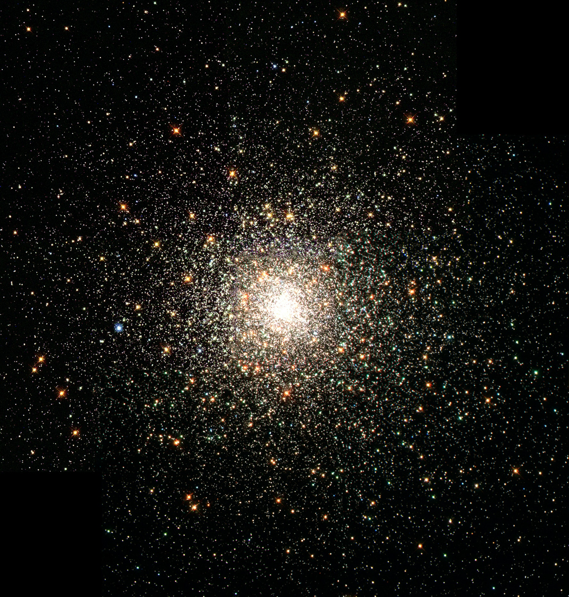

 

#  Graphical View

#### By Vera Weikel 

#### This is a project to build Basic Web Application using VueJS.

## Technologies Used

* [Vue](https://cli.vuejs.org/config/).
* Javascript
* CSS
* HTML
* GraphQL
* Mongoose
* Express
* Apollo
* UUID: $npm install uuid

## Goals/Objectives

This project shows how to ruan an Apollo server using GraphQL pinging a MongoDB database using Vue.

<!-- There are multiple branches in this repo that are described more below. -->

## Description

<!-- This is a help ticket queue targeting specific stations and clients needing assistance.  -->

<!-- ## Component Architecture -->
[Thank you NASA]("https://unsplash.com/photos/OVO8nK-7Rfs?utm_source=unsplash&utm_medium=referral&utm_content=creditShareLink")

<!-- 

 -->
## How To Run This Project

1. Clone this repo.
2. Open the terminal and navigate to this project's production directory called "Graphical View".
3. In your terminal type $ npm run start

## Known Bugs

* None

## License

MIT License

Permission is hereby granted, free of charge, to any person obtaining a copy
of this software and associated documentation files (the "Software"), to deal
in the Software without restriction, including without limitation the rights
to use, copy, modify, merge, publish, distribute, sublicense, and/or sell
copies of the Software, and to permit persons to whom the Software is
furnished to do so, subject to the following conditions:

The above copyright notice and this permission notice shall be included in all
copies or substantial portions of the Software.

THE SOFTWARE IS PROVIDED "AS IS", WITHOUT WARRANTY OF ANY KIND, EXPRESS OR
IMPLIED, INCLUDING BUT NOT LIMITED TO THE WARRANTIES OF MERCHANTABILITY,
FITNESS FOR A PARTICULAR PURPOSE AND NONINFRINGEMENT. IN NO EVENT SHALL THE
AUTHORS OR COPYRIGHT HOLDERS BE LIABLE FOR ANY CLAIM, DAMAGES OR OTHER
LIABILITY, WHETHER IN AN ACTION OF CONTRACT, TORT OR OTHERWISE, ARISING FROM,
OUT OF OR IN CONNECTION WITH THE SOFTWARE OR THE USE OR OTHER DEALINGS IN THE
SOFTWARE.

Copyright (c) 2023  VW
